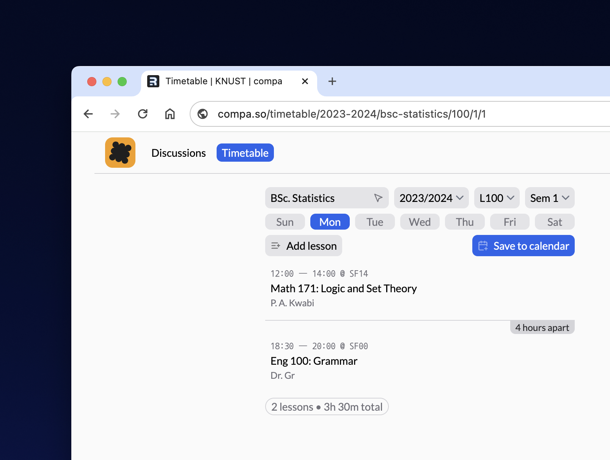

<p align="center"></p>

<h3 align="center">The COMPA Initiative</h3>
<p align="center"><a href="https://compa.so">compa.so</a></p>

<p align="center"></p>

# Compa

A companion application for students to manage and access resources at their higher education institution.

## About

As a fresher, settling into school could be easier. You usually need to find:

- Communities/Clubs you are interested in
- Semester timetables
- Resources from past semesters

For continuing students, it's just as hard to find documents or class notes when conversations are scattered across multiple platforms.

Being a student is hard enough, that's why Compa aims to be the go-to resource for higher education institutions and save you from one source of stress.

Your open, compact, companion and compass. That is _Compa_.

## Features

- [x] Timetable: See the lecture schedule for a semester and import it to your calendar. ❇️

- [x] Discussions: Ask questions, share ideas and interact with other students.

- [ ] Communities: Find and join groups that interest you.

## Schools

- [x] Kwame Nkrumah University of Science and Technology (KNUST) - <https://knust.compa.so>
- [x] University of Ghana (UG) - <https://ug.compa.so>
- [x] University of Mines and Technology (UMAT) - <https://umat.compa.so>

### Deploy an instance for your school

If you'd like to deploy an instance for your school:

1. Submit a PR with the title: `School Request: <School Name>`. The PR should be submitted with a file in `client/res` named `<school_id>.json`. The file's content should follow the format in [knust.json](/client/res/knust.json)

1. After your PR is reviewed and merged, click on the **Deploy on Railway** button below to deploy your instance.

1. Share your app's IP with us under the same PR so we can add a subdomain to compa for your school.

[](https://railway.app/template/VCnpoP)

Note that you bear the cost of hosting which is $5/month on Railway. You'll also need to set up an AWS compatible bucket. I recommend [Linode Object Storage](https://www.linode.com/docs/guides/platform/object-storage/) which also costs $5/month.

For email, [Resend](https://resend.com) is used. It's free for 100 mails per day.

> If you need any help, please reach us by mail mail@degreat.co.uk

## Run locally

Clone the project:

```bash
git clone https://github.com/blackmann/compa
cd compa
```

Run the following command to install dependencies and setup Prisma migrations:

```bash
yarn setup:all
```

Start the project in dev mode:

```bash
yarn dev:client
```

## Contributing

Contributions are always welcome! Please read the [contribution guidelines](CONTRIBUTING.md) first.
Also, please adhere to the [code of conduct](https://compa.so/code-of-conduct).

## Roadmap

Coming soon...
